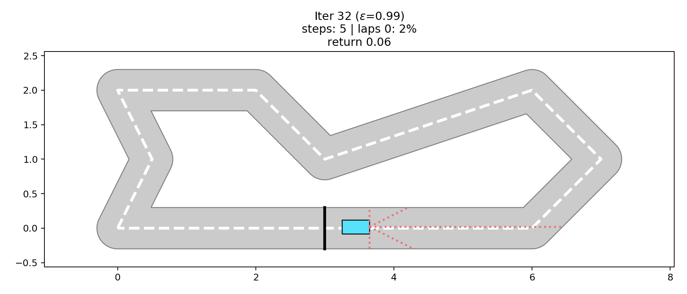
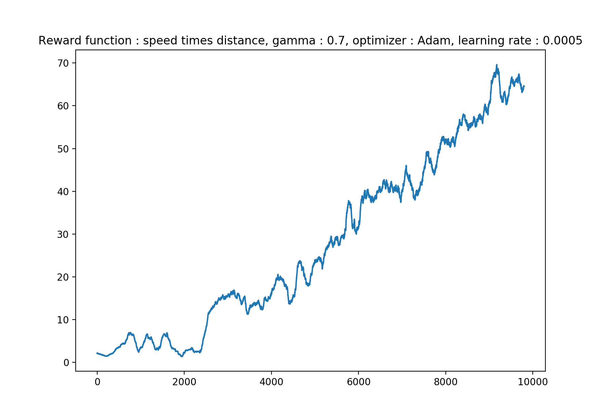
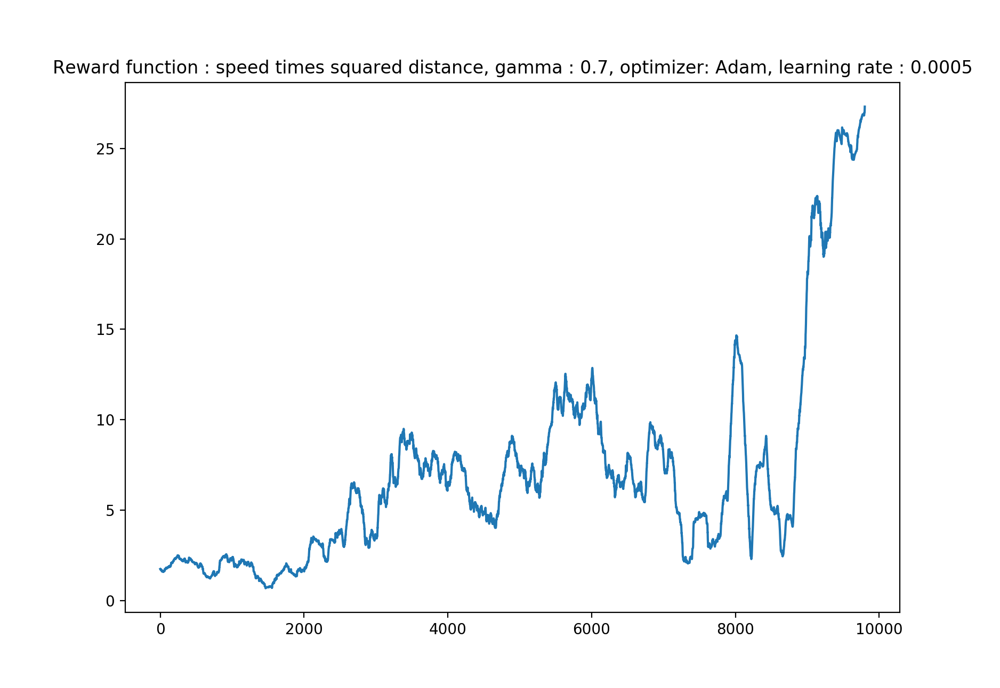

# Self-driving car with Deep-Q Network

This project aims at learning to a car how to drive on a circuit using deep reinforcement learning. I used a neural network to predict the reward being in a certain state and taking a certain action.



### Table of contents
* [Getting started](#getting-started)
+ [Parameters available for the training](#parameters-available-for-the-training)
* [My project](#my-project)
+ [Principal components](#principal-components)
    - [Environment](#environment)
    - [Agent](#agent)
+ [My methodology](#my-methodology)
    - [Training the model step by step](#training-the-model-step-by-step)
    - [Greedy policy](#greedy-policy)
    - [Choosing the neural network](#choosing-the-neural-network)
    - [Choosing the reward function](#choosing-the-reward-function)
    - [Choosing gamma](#choosing-gamma)
    - [Choosing the optimizer](#choosing-the-optimizer)

## Getting started

Start by installing the requirements:
```
sudo pip3 install -r requirements
```
To test my trained agent in a greedy way (saved in the .h5 file):
```
python3 -m scripts.run_test --model='weights.h5'
```

To train your own reinforcement learning agent with some parameters:
```
python3 -m scripts.run_train --num_episodes=X --output='my_weights.h5'
```
### Parameters available for the training

* num_episodes : how many episodes lasts the training
* max_steps : maximum number of steps in an episode
* minibatch_size : how many samples are used to train the neural network at each episode
* gamma : discount factor between 0 and 1, represents how much we value the future steps over the next step
* learning_rate : how fast we learn from batch while training the neural network
* output : location where the weights will be saved
* ui : True if you want to display the graphical interface and False if not

## My project

### Principal components

In the scope of the project, the circuit build with shapely, the car with its basic actions and the ui were provided, since it wasn't the main interest of this project. I built myself the components of the AI behind the car that is contained in the files environment.py and agent.py

#### Environment 
The environment links the car and the circuit, i.e makes the car advance depending on its action, determines if the car has crashed and thus if the game has ended. **Very important : the reward given to the car depending on its state is defined in this file**

#### Agent

Most of the AI logic is coded there, key functions : 
* build_model : build the neural network that will be used to learn reward
* act : make a move, either the best one predicted by our neural network or a random one if we follow a non greedy strategy
* updateEpsilon : change epsilon as the training goes to deal with the exploration/exploitation tradeoff
* replay : train the neural network using the memory of moves to fit the neural network with the reward expectation for the move that has been made

### My methodology 

#### Training the model step by step

Firstly I had hard time to train the car in one time, so what I did to understand how to proceed was to train one time the model to achieve a first decent score on the circuit, saving weights of the neural network. Training the model again etc...

I firsly started with the reward function being the product between the speed and the squared minimum of distances to the walls measured by the car. If the car crashes, he gets a -1 penalty. This reward encourages the car to move further by being careful. I took 0.7 as value for gamma and trained and neural networks with &1 hidden layer, because the problem is quite simple. My optimizer was Adam whose I could control its learning rate.
Here are the different step I took to obtain a first model capable of driving around the track:
* 1rst step : 5000 steps, learning rate = 0.01, minibatch size = 64, greedy policy : linear. I reached a score of 18% of the circuit completed.
* 2nd step : 3000 step, learning rate = 0.001, minibatch size = 100, greedy policy linear (but starting at 0.9). I reached a score of 30% of the circuit completed.
* 3rd step : 3000 step, learning rate = 0.0001, minibatch size = 128, greedy policy linear (but starting at 0.7). I reached a score of 55% of the circuit completed.
* 4th step : 3000 step, learning rate = 0.00001, minibatch size = 150, greedy policy linear (but starting at 0.5). I reached a score of 86% of the circuit completed.
* 5th step : 2000 step, learning rate = 0.000005, minibatch size = 200, greedy policy linear (but starting at 0.3). I reached a score of 154% of the circuit completed.

All the weights saved after a step are save in the folder "steps" of the project. 

#### Greedy policy 

The greedy policy I found by test and trial was the following : start by exploiting a lot new solutions (epsilon start at 1 : full random actions ) and reduce epsilon until it reaches 0.5.

When we pass 0.5, we slow the reducing of epsilon, as well as when we pass 0.3 and 0.1. Thus the algorithm spend more time exploiting than exploring.

#### Choosing the neural network 

Since the problem is very simple and since it musn't be slow to train, we don't need here a deep neural network. I then opted for a very simple model with one hidden layer of 64 neurons with ReLu activation.

#### Choosing the reward function
The reward function is the most important thing in our model because it will teach the car what actions are good or not. 

I tested multiple reward functions whose performances are illustrated by the graphs below, one for each reward function, trained over 10000 episodes, with a value of 0.7 for gamma and a learning rate of 0.0005 for our Adam optimizer. The graphs are obtained by taking the mean of the score over the last 200 scores. It represents how fast our model converges.
Firstly, I tested to gave a reward equal to the speed if the car is in the circuit and -1 if not. I reached a score of 86% of the circuit completed.

Secondly I tested multiplying the speed by the minimum of the distances measured by sensors so that the car is encouraged to go fast while staying far from the wall. I obtained the graph of convergence below and a best score of 186% of the track completed (One lap and 86%). We see the score is better than with the speed only as reward.



As the score was better, I tried to give more influence to the distances to the wall by squaring it. However I obtained a best score of 55% only, and the graph of convergence below that is very chaotic, it shows that the model doesn't learn very well the reward function that may be too complicated for this model:



#### Choosing gamma 

Gamma defines how much will the car take the future into account.

I tested three values  0.5, 0.7 and 0.9.

0.5 gave a max result of 77% of the circuit completed, 0.7 gave 186% and only 28% for 0.9.

Then I decided to narrow my search to 0.65, 0.7 and 0.75.

0.65 completed 76% of the lap and **0.75 gave me a very good best result with 3 laps fully completed without crashing.** However, it's the best result but not the final result after all the episodes so the model is still not perfect, we will content ourselves with the weights that gave us 3 laps completed.

#### Choosing the optimizer

As optimizer, I chose Adam with the learning rate specified in parameters. After multiple tries, I found that a small learning rate was required, indeed if the learning rate is too big, the model can't learn precisely enough to pass complex corners.

The neural network chosen and the optimizer are quite important to improve the efficiency of the training, although it is less important than the reward function or the exploration/exploitation tradeoff.


